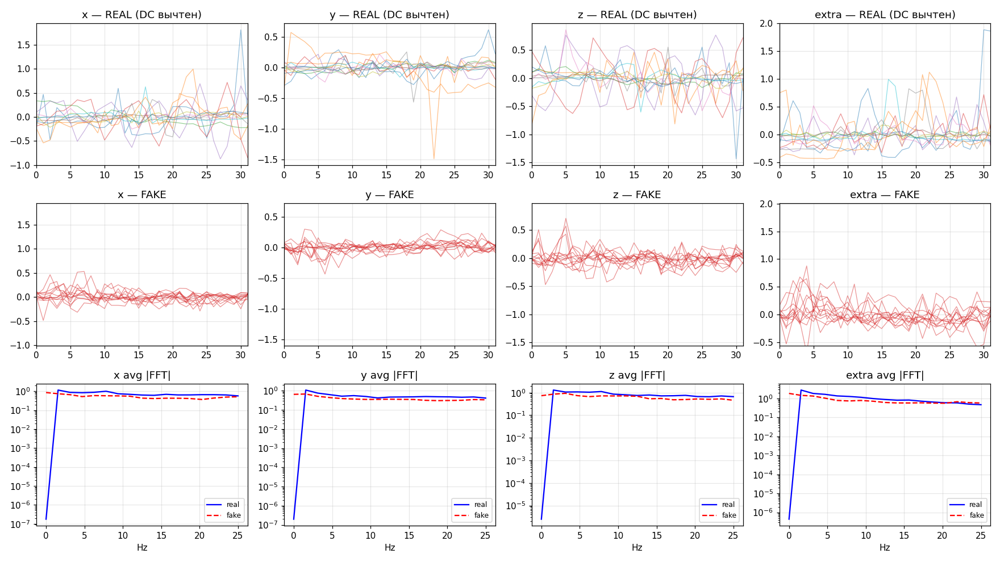
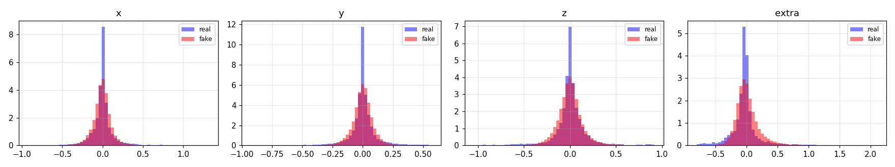

# WGAN-GP для генерации синтетических сейсмо-вибрационных сигналов

> Финальный проект по дисциплине **Generative Adversarial Networks (GANs)**.
> 1D-свёрточный Wasserstein GAN с Gradient Penalty, обученный на собственном
> датасете IMU-сигналов с ESP32-узла сейсмо-мониторинга здания.

---

## Содержание

1. [Цель проекта](#цель-проекта)
2. [Архитектура GAN](#архитектура-gan)
3. [Датасет](#датасет)
4. [Инструкция по запуску](#инструкция-по-запуску)
5. [Параметры обучения](#параметры-обучения)
6. [Результаты генерации](#результаты-генерации)
7. [Сравнение реальных и синтетических данных](#сравнение-реальных-и-синтетических-данных)
8. [Эксперименты и борьба с mode collapse](#эксперименты-и-борьба-с-mode-collapse)
9. [Структура репозитория](#структура-репозитория)
10. [Future work](#future-work)

---

## Цель проекта

Разработать и обучить **Generative Adversarial Network** для генерации
синтетических окон сейсмо-вибрационных сигналов, пригодных для:

- **Аугментации** обучающей выборки CNN-классификатора событий,
- **Тестирования** алгоритмов детекции движений нужной амплитуды,
- **Восполнения дефицита** реальных вибро-данных (в собранном корпусе
  активные события составляют всего **0.72%** отсчётов).

---

## Архитектура GAN

Модель — 1D-свёрточный **WGAN-GP** (Wasserstein GAN with Gradient Penalty).

### Generator G — 27 764 параметра

```
z ∈ ℝ³² ──► Linear(32 → 256) ──► reshape (64, 4)
            BatchNorm1D + ReLU
            ConvTranspose1D(64 → 48, k=4, s=2, p=1)  ──► (48, 8)
            BatchNorm1D + ReLU
            ConvTranspose1D(48 → 32, k=4, s=2, p=1)  ──► (32, 16)
            BatchNorm1D + ReLU
            ConvTranspose1D(32 →  4, k=4, s=2, p=1)  ──► (4, 32)
            линейный выход
```

**Выход:** `(B, 4, 32)` — четыре канала (x, y, z, extra) × 32 отсчёта (0.64 с @ 50 Гц).

### Critic D — 45 281 параметр

```
x ∈ ℝ^(4×32) ──► Conv1D(4  → 32,  k=4, s=2, p=1) + LayerNorm + LeakyReLU(0.2)  ──► (32, 16)
                 Conv1D(32 → 64,  k=4, s=2, p=1) + LayerNorm + LeakyReLU(0.2)  ──► (64, 8)
                 Conv1D(64 → 128, k=4, s=2, p=1) + LayerNorm + LeakyReLU(0.2)  ──► (128, 4)
                 Flatten + Linear(512 → 1)
```

**Особенности WGAN-GP:**

- Critic выдаёт **скалярную оценку** (не sigmoid),
- **LayerNorm** вместо BatchNorm (BatchNorm нарушает условие Lipschitz),
- **Gradient Penalty** обеспечивает 1-Lipschitz constraint мягко, через регуляризацию.

### Loss-функции

```
L_D = − E[D(x_real)] + E[D(G(z))] + λ · E[(‖∇D(x̂)‖₂ − 1)²]      x̂ = εx + (1−ε)G(z)
L_G = − E[D(G(z))]
```

При обучении критик обновляется `N_critic = 3` раз на одно обновление генератора.

---

## Датасет

**Источник:** собственный набор лог-файлов IMU с ESP32-узла,
переданных по Bluetooth (Serial-over-rfcomm).

| Параметр | Значение |
|---|---|
| Каналов | 4 (accX, accY, accZ, extra/RMS) |
| Файлов | 47 |
| Всего отсчётов | 2 657 729 |
| Частота семплирования | 50 Гц |
| Покрытие | 03.2026 – 04.2026 |
| Активных отсчётов | 19 068 (0.72%) |

### Конвейер подготовки

1. Парсинг текстовых логов формата `t_ms,x,y,z,extra`, отбрасывание boot-сообщений ESP32.
2. **Детектор активности**: `extra > 0.05 g`, склейка близких событий с зазором ≤ 0.5 с.
3. Нарезка скользящих окон длиной **W = 32** с шагом **HOP = 4** (75% перекрытие).
4. **Вычитание DC** по каждому окну для каждого канала (убрана гравитация и DC-смещения).
5. **z-score нормализация** по статистикам обучающей выборки.

| Сплит | Окон |
|---|---|
| Train | 378 |
| Validation | 128 |
| **Всего** | **506** |

Распределение пиковой амплитуды `extra` по окнам: `min=0.057 g`, `median=0.484 g`, `max=5.44 g`.

---

## Инструкция по запуску

### Требования

- Python 3.10+
- PyTorch 2.x (CPU-версии достаточно)
- NumPy, SciPy, matplotlib, python-pptx
- Опционально для сбора данных: `pyserial`

```bash
pip install torch numpy scipy matplotlib python-pptx
```

### Воспроизведение результатов с нуля

```bash
# 1. Разведка — где в логах есть вибрации
python _discover.py

# 2. Сборка датасета v2 (с DC-вычитанием и жёстким порогом)
python _make_dataset_v2.py

# 3. Обучение WGAN-GP (~19 секунд на CPU)
python _train_gan_v2.py

# 4. Оценка качества — генерирует _compare_v2.png и _hist_v2.png
python _eval_v2.py
```

### Использование готовой модели

Готовый чекпойнт лежит в `_gan_v2.pt`. CLI-генератор:

```bash
# 16 окон по умолчанию
python generate.py

# 1000 окон в свой файл
python generate.py --n 1000 --out my_samples.csv

# Воспроизводимая генерация
python generate.py --n 100 --seed 42
```

Формат вывода — широкий CSV: первая колонка `t_ms` (0, 20, 40, …, 620),
далее по 4 колонки на каждое окно (`x_i, y_i, z_i, extra_i`).

---

## Параметры обучения

| Параметр | Значение |
|---|---|
| Оптимизатор | Adam (β₁=0.5, β₂=0.9) |
| Learning rate G и D | 1 × 10⁻⁴ |
| Batch size | 64 |
| Epochs | 80 |
| N_critic | 3 |
| Латентная размерность z | 32 |
| λ Gradient Penalty | 10.0 |
| Hardware | CPU only (Python 3.11 + PyTorch 2.4) |
| Время обучения | ~19 секунд |
| Seed | 42 |

### Журнал W-distance

```
ep   1/80 | D= 1.198  G= 0.341  | W-dist = 0.437
ep  10/80 | D=−6.496  G= 3.484  | W-dist = 7.373
ep  25/80 | D=−5.605  G= 3.843  | W-dist = 6.302
ep  40/80 | D=−4.303  G= 6.531  | W-dist = 4.932
ep  55/80 | D=−3.612  G= 9.993  | W-dist = 4.190
ep  80/80 | D=−3.862  G=15.536  | W-dist = 4.487
```

**Интерпретация:** Wasserstein-1 distance падает с 7.37 → 4.49, что отражает
постепенное сближение распределений real/fake. Рост `G loss` — нормальное
явление в WGAN: критик становится сильнее по абсолютной величине.

---

## Результаты генерации

### Real vs Fake — формы и спектры



- **Строка 1** — 12 случайных реальных окон по каждому каналу (после DC-вычитания).
- **Строка 2** — 12 сгенерированных окон в том же Y-диапазоне.
- **Строка 3** — средний модуль БПФ в лог-шкале: синяя сплошная — real, красная пунктирная — fake.

### Гистограммы амплитуд



Распределения real и fake хорошо перекрываются вокруг нуля; различие — в хвостах
(модель недо-выучила экстремальные пики, что отражено в заниженной σ).

---

## Сравнение реальных и синтетических данных

| Канал | real μ | fake μ | real σ | fake σ | Wasserstein-1 |
|---|---:|---:|---:|---:|---:|
| x | 0.0000 | −0.0070 | 0.2271 | 0.1139 | 0.0384 |
| y | −0.0000 | −0.0003 | 0.1742 | 0.0847 | 0.0311 |
| z | 0.0000 | 0.0028 | 0.2526 | 0.1391 | 0.0399 |
| extra | −0.0000 | 0.0140 | 0.3708 | 0.1882 | 0.0777 |

**Что хорошо:**
- Средние значений совпадают с погрешностью 1×10⁻² — DC-вычитание корректно.
- W₁ < 0.08 по всем каналам — распределения близки.
- Средние спектры |FFT| по x, y, z визуально совпадают.

**Что хуже:**
- Стандартное отклонение fake ≈ половина real — генератор «осторожничает» на экстремальных пиках.
- Спектр канала `extra` расходится сильнее остальных (хвост распределения недо-выучен).

---

## Эксперименты и борьба с mode collapse

В проекте проведены **две итерации обучения**, демонстрирующие классическую
проблему GAN и методы её решения.

### Итерация v1 — BCE-GAN с мягким порогом (провал)

- Датасет: 72 337 окон при `extra > 0.015` (включая фоновый шум).
- Loss: бинарная кросс-энтропия + label smoothing + instance noise.
- **Результат:** мод-коллапс. Генератор выучил «средние спокойные окна»
  и полностью проигнорировал редкие вибро-всплески.
- Acc дискриминатора по real ≈ 0.4 — нестабильное равновесие.

### Итерация v2 — WGAN-GP с жёстким порогом (успех)

| Изменение | Зачем |
|---|---|
| Порог `extra > 0.05` | Выкинуть фоновый шум из обучения |
| Вычитание DC по окну | Заставить модель учить **форму**, а не уровни |
| Wasserstein loss + GP (λ=10) | Гладкие градиенты, отсутствие vanishing gradient |
| LayerNorm в критике | Сохранить условие 1-Lipschitz |
| BatchNorm в генераторе | Стабилизировать G |
| Adam (β₁=0.5, β₂=0.9) | Стандарт WGAN, меньше моментум |
| N_critic = 3 | Критик идёт впереди G |

**Результат:** генератор воспроизводит характер реальных вибраций
(формы и спектр), хотя амплитуда экстремальных событий занижена.

---

## Структура репозитория

```
esp/
├── README.md                       — этот файл
├── .gitignore
├── main.py                         — приёмник IMU-данных по Bluetooth (ESP32)
├── generate.py                     — CLI-генератор синтетических окон
│
├── _discover.py                    — детектор вибро-сегментов в логах
├── _discover2.py                   — подбор порогов и размеров окна
├── _analyze.py                     — общая статистика по датасету
│
├── _make_dataset_v2.py             — сборка тренировочного датасета
├── _train_gan_v2.py                — обучение WGAN-GP
├── _eval_v2.py                     — построение графиков сравнения
│
├── _gan_v2.pt                      — обученные веса модели (298 КБ)
├── _samples_v2.npy                 — батч сгенерированных окон
├── _compare_v2.png                 — графики real vs fake (формы + спектры)
├── _hist_v2.png                    — гистограммы амплитуд
│
├── _build_pptx.py                  — генератор презентации
├── prezentaciya_1_2.pptx           — финальная презентация (10 слайдов)
│
└── (raw data — игнорируется git)
    ├── imu_data_*.txt              — 47 файлов IMU-логов (~169 МБ)
    └── lora_angles_*.txt           — 208 файлов LoRa-логов (~284 МБ)
```

---

## Future work

- **Conditional GAN**: метка пиковой амплитуды окна (массив `amp_tr` уже сохранён
  в `_dataset_v2.npz`) → возможность управлять силой генерируемой вибрации.
- **Расширение датасета** до ~5 000 реальных вибро-окон — поможет снять
  занижение σ, особенно для канала `extra`.
- **Spectral consistency loss** — прямое выравнивание FFT-спектров real/fake
  как вспомогательный лосс.
- **EMA весов генератора** — стандартный приём для улучшения качества образцов.
- **Multi-scale CNN**: одновременно ловить быстрые транзиенты и медленные тренды.
- **Интеграция с CNN-классификатором события** — оценить вклад синтетических
  данных в метрики детектора (precision/recall на тестовой выборке).

---

## Соответствие требованиям дисциплины

| Требование | Где реализовано |
|---|---|
| Generator | `_train_gan_v2.py`, класс `Generator` |
| Discriminator | `_train_gan_v2.py`, класс `Critic` |
| Adversarial training | основной цикл `_train_gan_v2.py` |
| Собственный датасет | 47 IMU-логов, `_make_dataset_v2.py` |
| Настройка гиперпараметров | две итерации (v1 → v2), см. лог |
| Сравнение эпох | журнал W-distance в обучении |
| Loss-функции | Wasserstein + Gradient Penalty |
| Сравнение real / fake | `_eval_v2.py`, `_compare_v2.png`, `_hist_v2.png` |
| Борьба с mode collapse | переход BCE-GAN → WGAN-GP |
| Batch normalization | в генераторе |
| Wasserstein loss | основной loss модели |
| Регуляризация | Gradient Penalty (λ=10) |
| Визуализация результатов | 2 PNG + 10-слайдовая презентация |

---

**Автор:** студент Аймаганбетов · 2026
